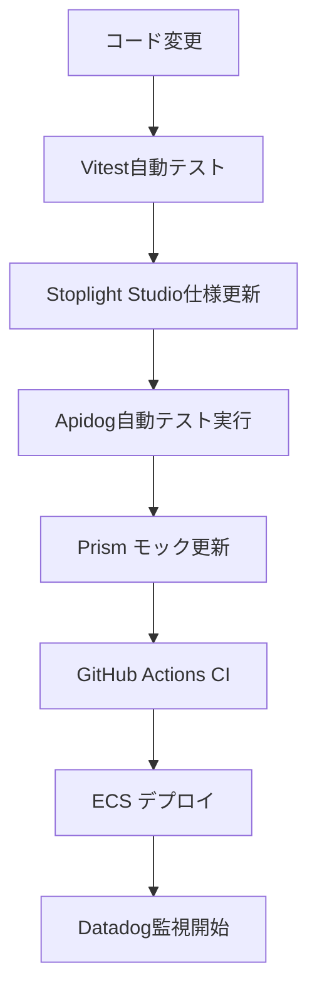

# 📚 API可視化・モック・監視の導入

### ゴール

開発効率と観測性を高め、
**API設計・テスト・監視を一元化すること。**

---

## 📋 ステップ1：Stoplight Studio（API設計）

### 手順

| タスク | 作業内容                           | コマンド・ファイル                            | DoD（確認方法）                                   |
| ---- | ------------------------------ | ------------------------------------ | ------------------------------------------- |
| 1️⃣  | Stoplight Studioセットアップ       | Web版またはDesktop版インストール             | Stoplight Studioが起動する                     |
| 2️⃣  | OpenAPI 3.0仕様書作成             | tech-blog-api.yaml                  | 基本的なAPI仕様が定義されている                        |
| 3️⃣  | エンドポイント定義                    | `/api/v1/posts`, `/api/v1/auth` など | 主要エンドポイントが仕様書に記載されている                   |
| 4️⃣  | Zodスキーマとの整合性確認               | TypeScript型定義との同期                 | 仕様書とコード実装が一致している                          |
| 5️⃣  | バリデーションルール定義                 | 必須項目、型制約、文字数制限など                 | リクエスト・レスポンスの制約が明確に定義されている               |

---

## 🐕 ステップ2：Apidog（テスト・共有）

### 構成内容

* API仕様のブラウザ管理
* 自動テストスイート作成
* チーム共有（将来用）
* ドキュメント自動生成

### 設定例

```yaml
# apidog.config.yml
project:
  name: "Tech Blog API"
  version: "1.0.0"
  baseUrl: "http://localhost:3000"
  
environments:
  - name: "local"
    baseUrl: "http://localhost:3000"
  - name: "staging" 
    baseUrl: "https://staging.yourdomain.com"
  - name: "production"
    baseUrl: "https://api.yourdomain.com"
```

### DoD（確認）

| 項目            | 方法                            | 期待結果                         |
| ------------- | ----------------------------- | -------------------------- |
| API仕様インポート    | OpenAPI YAMLファイルをApidog読み込み   | 全エンドポイントが正しく表示される        |
| 自動テスト作成      | 各エンドポイントのテストケース作成           | リクエスト・レスポンスの検証が自動実行される   |
| 環境切り替え       | local/staging/production環境の設定 | 環境ごとにベースURLが切り替わる         |
| ドキュメント生成     | API仕様書の自動生成                  | 読みやすいHTML形式のドキュメントが生成される |

---

## 🎭 ステップ3：Prism（モックサーバー）

### 構成内容

* OpenAPI仕様からモックサーバー自動生成
* フロントエンド開発との並行進行
* レスポンス例の動的生成
* エラーケースのテスト

### コマンド例

```bash
# Prismモックサーバー起動
npx @stoplight/prism-cli mock tech-blog-api.yaml --port 4010

# 動的レスポンス生成
npx @stoplight/prism-cli mock tech-blog-api.yaml --dynamic

# エラーレスポンステスト
curl -H "Prefer: code=500" http://localhost:4010/api/v1/posts
```

### DoD（確認）

| 項目       | 方法                                     | 期待結果                    |
| -------- | -------------------------------------- | ----------------------- |
| モック起動    | `prism mock` コマンド実行                    | モックサーバーが指定ポートで起動      |
| レスポンス生成  | 各エンドポイントへのGETリクエスト                   | OpenAPI仕様に基づくモックデータ返却 |
| エラーテスト   | Preferヘッダーで異なるステータスコード指定             | 400, 404, 500等のエラーレスポンス |
| フロント連携   | React側からモックAPI呼び出し                    | フロントエンドが正常に動作する       |

---

## 📊 ステップ4：Datadog（監視・APM）

### 構成内容

* ECSコンテナ監視
* アプリケーションログ収集
* APM（Application Performance Monitoring）
* カスタムメトリクス設定

### Terraform設定例

```hcl
# infra/datadog.tf
resource "aws_ecs_task_definition" "app" {
  family = "tech-blog-app"
  
  container_definitions = jsonencode([
    {
      name  = "backend"
      image = "your-backend-image"
      environment = [
        {
          name  = "DD_API_KEY"
          value = var.datadog_api_key
        },
        {
          name  = "DD_SITE"
          value = "datadoghq.com"
        }
      ]
    },
    {
      name  = "datadog-agent"
      image = "public.ecr.aws/datadog/agent:latest"
      environment = [
        {
          name  = "DD_API_KEY"
          value = var.datadog_api_key
        },
        {
          name  = "DD_APM_ENABLED"
          value = "true"
        }
      ]
    }
  ])
}
```

### DoD（確認）

| 項目       | 方法                                     | 期待結果                    |
| -------- | -------------------------------------- | ----------------------- |
| Datadog連携 | ECSタスクにDatadog Agentコンテナ追加          | Datadogダッシュボードにメトリクス表示 |
| ログ収集     | アプリケーションログがDatadogに送信             | ログがDatadogで検索・フィルタ可能  |
| APM設定    | API呼び出しのトレース情報収集                    | レスポンス時間・エラー率が可視化される   |
| アラート設定   | エラー率・レスポンス時間の閾値アラート設定              | 異常時にSlack等に通知される      |

---

## 🔧 ステップ5：統合ワークフロー

### 構成内容

* 開発フロー全体の統合
* CI/CDパイプラインとの連携
* API仕様変更時の自動更新
* チーム開発準備

### ワークフロー例



### DoD（確認）

| 項目       | 方法                                     | 期待結果                    |
| -------- | -------------------------------------- | ----------------------- |
| 仕様書連携    | OpenAPI変更 → 自動でApidog・Prism更新        | 仕様変更が各ツールに自動反映される     |
| テスト自動化   | API変更時のテストスイート自動実行                  | 回帰テストが自動で走る           |
| 監視連携     | デプロイ後のDatadog自動監視開始                 | 新機能のメトリクス収集が開始される     |
| ドキュメント更新 | 仕様変更時のドキュメント自動生成                   | 最新のAPI仕様書が常に利用可能      |

---

## ✅ ステップ6：DoD総まとめ

| 項目                           | チェック方法                              | 状態 |
| ---------------------------- | ----------------------------------- | -- |
| Stoplight StudioでAPI設計完了     | OpenAPI 3.0仕様書が作成されている            | ✅  |
| ApidogでAPI管理・テスト環境構築        | ブラウザでAPI仕様管理・テスト実行可能            | ✅  |
| Prismモックサーバーでフロント開発支援      | フロントエンドがモックAPIで開発可能             | ✅  |
| DatadogでECS・アプリ監視             | メトリクス・ログ・APMが正常に収集されている         | ✅  |
| API開発ワークフロー全体統合             | 設計→実装→テスト→監視のサイクル完成             | ✅  |
| チーム開発準備完了                    | API仕様共有・ドキュメント自動生成が可能           | ✅  |

---

## 📘 推奨ディレクトリ構造

```bash
api/
├── openapi/
│   ├── tech-blog-api.yaml    # OpenAPI仕様書
│   └── schemas/              # 共通スキーマ定義
├── tests/
│   ├── apidog/              # Apidogテストケース
│   └── prism/               # Prismモック設定
└── docs/                    # API関連ドキュメント

infra/
├── datadog.tf               # Datadog監視設定
└── variables.tf             # Datadog API Key等

.github/
└── workflows/
    └── api-integration.yml   # API統合テストワークフロー
```
